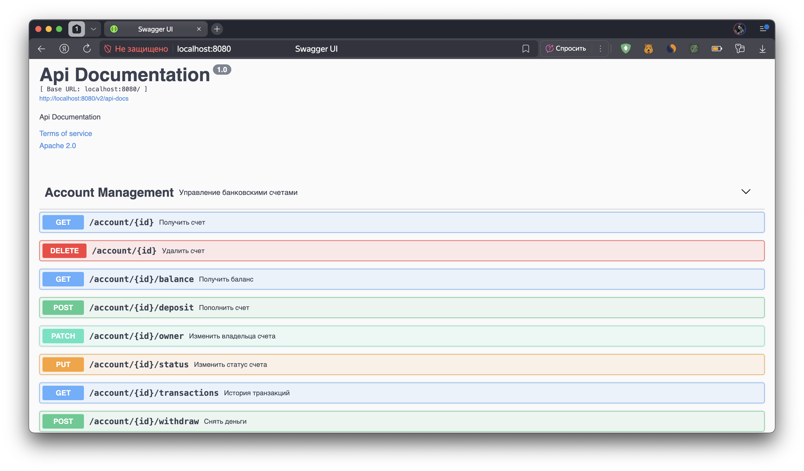
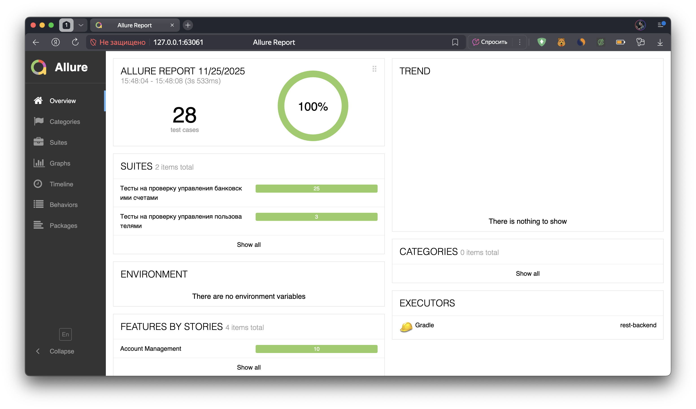
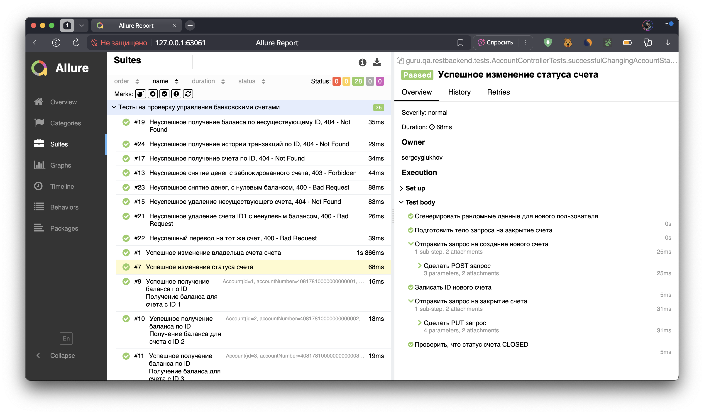
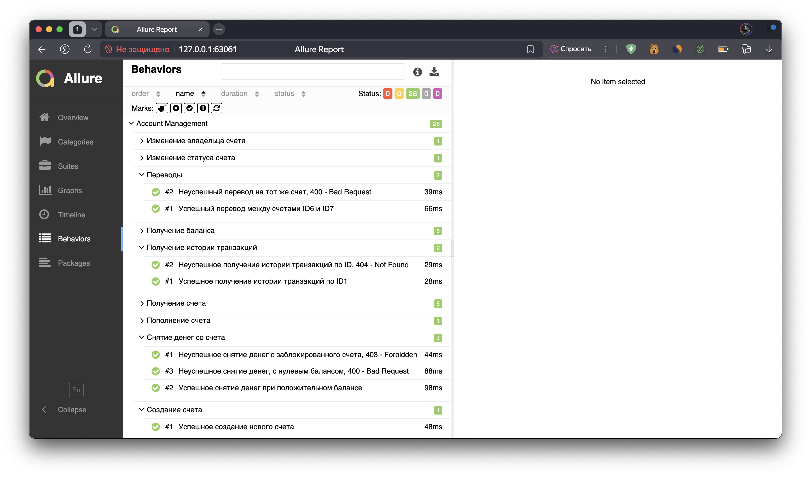

# REST Backend Service

Небольшой учебный backend-сервис на **Spring Boot**, предоставляющий REST-эндпоинты для управления счетами, транзакциями и пользователями. Все ключевые бизнес-потоки покрыты интеграционными тестами на **RestAssured + JUnit5**. Отчётность реализована через **Allure**, документация API — через **Swagger**.

## 🛠️ Стек технологий

- Java 17
- Spring Boot 2.x
- RestAssured, JUnit5, AssertJ
- Allure (отчетность), Owner
- Swagger 2 (OpenAPI)

## 📁 Структура проекта

```
src/
├── main/
│ └── java/guru/qa/restbackend/
│       ├── RestBackendApplication.java
│       ├── controller/
│       ├── domain/
│       ├── exception/
│       └── service/
│ └── resources/
│       └── application.properties
└── test/
    └── java/guru/qa/restbackend/
        ├── config/
        ├── helpers/
        ├── specs/
        └── tests/
    └── resources/
        └── auth.properties
```

## 🚀 Основная функциональность

- **Создание, пополнение, снятие, перевод и удаление банковских счетов**
- **Получение баланса, истории транзакций, статуса и владельца счета**
- **Авторизация и список пользователей**
- **Обработка ошибок: проверки баланса, статуса, неверных данных**

## 🧪 Автотесты

Все бизнес-сценарии покрыты автотестами c RestAssured:
- 🟢 CRUD операции с аккаунтом
- 🟢 Транзакции: пополнение, снятие, перевод
- 🟢 Проверка баланса, статуса, владельца
- 🟢 Авторизация
- 🟢 Edge cases и обработка ошибок

### Запуск тестов и Allure-отчета

1. Запустить проект: `gradle bootRun`
2. Запустить тесты: `gradle clean test`
3. Сформировать и открыть отчет:  
   `gradle allureReport`  
   `gradle allureServe`

Allure автоматически откроет отчет в браузере.

## 📘 Swagger UI

Документация API доступна после старта по адресу: http://localhost:8080/swagger-ui/#/

<p>

</p>

## 🖼️ Пример Allure-отчета

Главная страница отчета:

<p>

</p>

Тест-кейсы:

<p>

</p>

Сортировка по Feature и Story:

<p>

</p>

## ✨ Как устроена архитектура тестов

- **TestApiHelper** — универсальные методы для HTTP операций.
- **ResponseHelpers** — парсинг результатов.
- **Parameterization & Data Isolation** — независимые тестовые сценарии.
- **Allure-аннотации** — структурируют отчёт и показывают сценарии по категориям.

## ⚡️ Быстрый старт для разработчика

- Требуется JDK 17+
- Порт по умолчанию: 8080
- Тестовые данные — внутри `TestDataInitializer.java`
- Swagger подтягивает описание эндпоинтов